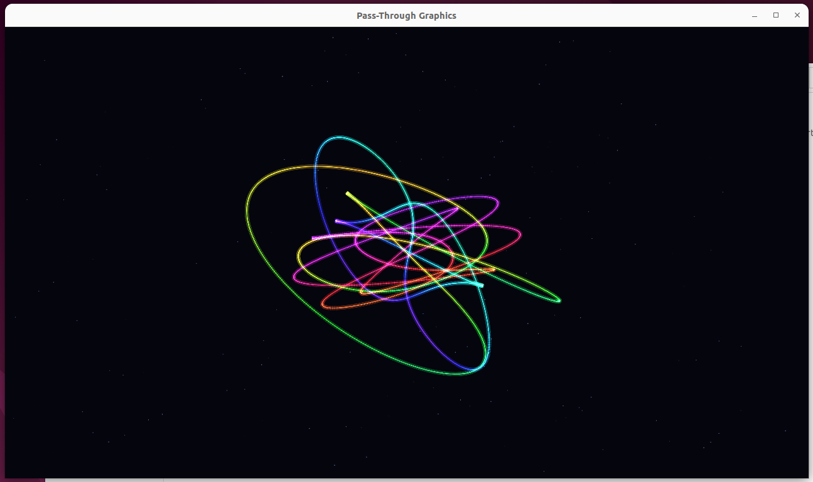

# `4-graphics`: Two libraries and a live GUI

Layer 4 does **two libraries at once, and a live, interactive window**: a small OpenGL program whose Xlib *and* OpenGL/GLX calls all run on the host.

[`Program.cpp`](guest/Program.cpp) is a self-contained GLX + immediate-mode GL demo — glowing, spinning torus knots over a starfield. It opens a window with Xlib and draws with OpenGL, but it is built against **drop-in `libX11.so` and `libGL.so`**, so every `XCreateWindow`, `glBegin`, `glXSwapBuffers`, … is forwarded to the host's real Xlib/OpenGL and rendered on the host display.

The same [`GenerateSource.py`](GenerateSource.py) approach produces **both** thunk pairs — one for [`X11Symbols.conf`](X11Symbols.conf), one for [`GLSymbols.conf`](GLSymbols.conf) — and reuses the `2-callback` runtime unchanged. Every function this demo uses is pure data pass-through: there are no host-to-guest callbacks and no varargs in the forwarded surface, so the generated code is one guest stub and one host adapter per symbol.

What lets an unmodified windowing stack survive this is the shared address space:

* Xlib's **macros** (`DefaultScreen`, `RootWindow`) and **struct fields** (`XVisualInfo`, `XEvent`) are read by the guest straight out of the host-owned structs — there is no symbol to thunk.
* **Opaque host handles** — a `Display *`, an `XVisualInfo *`, a `GLXContext` — flow between the `libX11` and `libGL` thunks as plain values the guest never dereferences.

## Build and Run

To run this demo, an available X11 display is required. On a normal Linux desktop, running from the host session is usually enough as long as `DISPLAY` is set and GLX works. In Docker, you need to expose the X socket and pass `DISPLAY`; on Wayland desktops this normally goes through XWayland.

```sh
cd 4-graphics
./build.sh
./run.sh
```

Expected output:



### Run in Docker Container

A minimal Docker run command for an X11 desktop looks like this:

```sh
docker run --rm -it \
    -e DISPLAY="$DISPLAY" \
    -v /tmp/.X11-unix:/tmp/.X11-unix \
    -e XAUTHORITY="$XAUTHORITY" \
    -v "$XAUTHORITY":"$XAUTHORITY" \
    passthrough-image /bin/bash
```

Depending on your desktop security policy, you may also need to allow the container user to connect to the host X server.

If it exits with an X authorization error and cannot open the display, your X server is refusing the connection. Re-running through `sudo` while keeping your environment usually fixes it:

```sh
sudo -E ./run.sh
```
